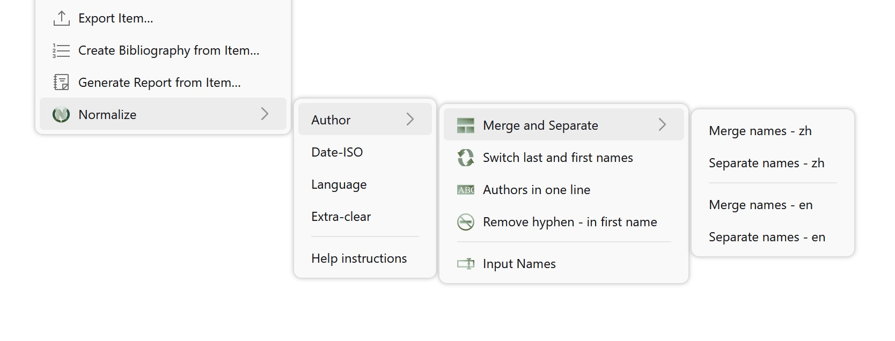
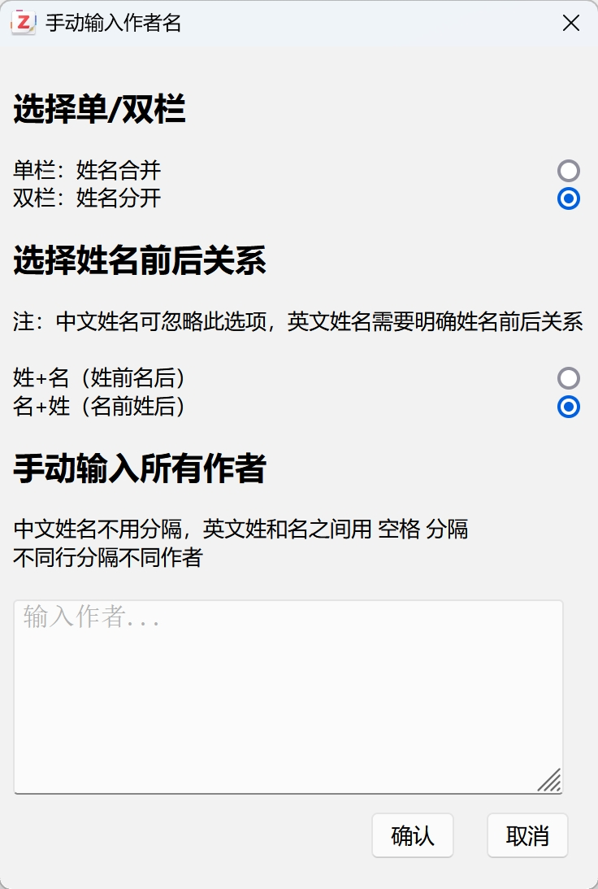

# 📚 Zotero Normalize Plugin

[简体中文](README.md) | [English](doc/README-En.md)

A plugin for batch and manual modification of Zotero item data, helping users efficiently organize bibliographic metadata.

This plugin aims to support users in performing batch manual modifications of Zotero item data to improve the efficiency of bibliographic metadata organization.

The plugin was initially developed to address limitations of automatic repair functions and to implement custom normalization features. It is recommended to first use the Linter plugin  for automatic item normalization, which can resolve most item standardization issues. However, special cases still exist, such as all authors being on the same line or reversed author name order. In such cases, users can make manual adjustments through this plugin. If the modification process is complex, users can also directly input all author information for the literature to quickly achieve normalization of author names and their order.

Additionally, this plugin supports users in customizing the display format of author names (single-field or dual-field) according to personal preferences, better adapting to different users' reading habits.

---

## 🧩 Feature Overview

Zotero Normalize provides the following core functions:

Multi-select items for batch processing, with plugin menu appearing on right-click:

### 1️⃣ Author Field Disorder Correction

Handles chaotic author name formatting issues with support for multiple operation modes:

- **1.1 Author Name Splitting and Merging**
  - Choose different processing methods based on literature language (Chinese/English)
  - Dual-field mode: Last name first, first name last
  - Single-field mode:
    - Chinese: Maintains last name first, first name last with no spaces between names, conforming to reading habits
    - English: Maintains first name first, last name last, conforming to reading habits

- **1.2 Swap Author Names**
  - Suitable for cases where author last and first names are reversed
  - Recommended for use in dual-field mode
  - Single-field mode uses the first space to separate last and first names by default; Chinese names automatically recognize common surnames for name separation

- **1.3 Batch Modification of Authors on Same Line**
  
  - Automatically recognizes and splits when all authors are on the same line
  - Requires selection of separator between authors on the same line
  
  
  
- **1.4 Remove Hyphens from Names**
  - Recommended for use in dual-field mode
  - Single-field mode uses the last space to separate last and first names by default, with the front part being the first name

- **1.5 Manual Input of Author Information**
  - When item authors are mostly missing or when the above adjustments are inconvenient, all authors can be manually input
  - Options for dual-field or single-field mode, with author input according to page prompts
    

### 2️⃣ Batch Date Format Modification

Converts dates in items to unified ISO standard format: `YYYY-MM-DD`

### 3️⃣ Batch Literature Language Modification

Supports unified setting of item language, with option to customize target language value

### 4️⃣ Batch Clear Extra Field

Clears Extra field content in items, facilitating subsequent addition of comments or notes

---

## 🚀 Installation

1. Download the `.xpi` plugin file
2. Open Zotero, click `Tools` → `Add-ons` in the top menu bar
3. Click the gear icon in the upper right corner → `Install Add-on From File`
4. Select the downloaded `.xpi` file and install
5. Restart Zotero to use

---

## 💡 Usage Recommendations

- When processing author information, it's recommended to first confirm the item language for optimal results
- The plugin supports batch operations but also provides manual input functionality, suitable for special item processing
- Before clearing Extra fields, please confirm there's no important information to avoid accidental deletion

---

## 🛠️ Developer Information

This plugin is built on [Zotero Plugin Template](https://github.com/windingwind/zotero-plugin-template) and supports Zotero 7.

Feedback and suggestions are welcome!

---
